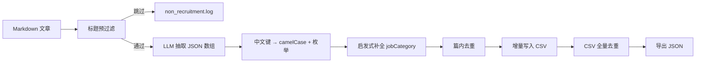
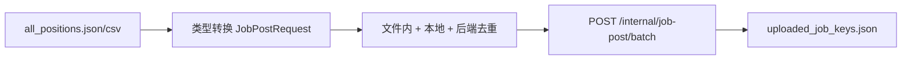

# FusionCareer-Algorithm

FusionCareer 算法侧仓库：**校园招聘公众号 Markdown 文章 → 结构化岗位数据 → 去重 → 导出 CSV/JSON →（可选）上传后端**。

- **本仓库负责**：LLM 结构化、字段对齐、去重、流水线编排、后端批量导入脚本。
- **本仓库不负责**：微信公众号爬虫、后端 Java 服务（由其他同事维护）。
- **与后端契约**：输出字段对齐 `JobPostRequest`（`fusioncareer-api`），枚举为 Java 常量英文名（如 `ENTERPRISE`、`CAMPUS_RECRUITMENT`）。

---

## 1. 项目简介

高校就业公众号每天发布大量招聘推文（Markdown）。本模块使用大模型（默认 DeepSeek）从每篇文章中抽取 **一个或多个** 独立岗位，映射为与后端一致的 camelCase 字段，并在写入前做多层去重：

| 去重层级 | 说明 |
|----------|------|
| 篇内去重 | 同一篇文章 LLM 返回的重复岗位 |
| 增量去重 | 与已有 CSV 及本次批量已写入记录比对 |
| CSV 全量去重 | 流水线结束后对输出文件再扫一遍（保留首行） |
| 上传去重 | 上传脚本按本地状态 +（可选）后端已有岗位跳过重复 |

标题预过滤会跳过双选会通稿、生涯讲座等非具体招聘类文章，并记入 `logs/non_recruitment.log`。

---

## 2. 项目结构

```
FusionCareer-Algorithm/
├── pipeline/
│   ├── run_pipeline.py          # 主流水线：结构化 → 去重 → CSV/JSON
│   └── upload_to_backend.py     # 可选：批量上传至后端 JobPost API
├── job_structuring/
│   ├── engine.py                # LLM 抽取、枚举映射、去重核心逻辑
│   ├── paths.py                 # data/、logs/、config 路径解析
│   ├── export.py                # CSV → JSON 导出
│   └── upload_backend.py        # 上传适配（类型转换、去重、批量 POST）
├── data/
│   ├── articles/                # 默认 Markdown 输入目录（可空）
│   └── output/                  # all_positions.csv / .json
├── logs/                        # 运行日志与上传状态（不提交 Git）
├── 公众号文章/                  # 历史数据目录（若存在则自动回退使用）
├── config.json                  # 本地配置（含 API Key，已 gitignore）
├── config.json.example          # 配置模板（可提交）
├── requirements.txt
├── structure_data.py            # 兼容旧 CLI（转发至 engine）
└── README.md
```

---

## 3. 环境配置

### 3.1 系统要求

- Python **3.10+**（推荐 3.11）
- 可访问 DeepSeek API（或兼容 OpenAI Chat Completions 的端点）
- 上传后端时：FusionCareer 后端服务已启动（默认端口 `9100`，以实际部署为准）

### 3.2 安装依赖

在仓库根目录执行：

```bash
pip install -r requirements.txt
```

| 依赖 | 用途 |
|------|------|
| `requests` | LLM HTTP 调用、后端上传 |
| `openpyxl` | 可选 Excel 导出（`structure_data.py --export-xlsx`） |

### 3.3 初始化配置与目录

```bash
# Windows
copy config.json.example config.json

# Linux / macOS
cp config.json.example config.json
```

首次运行 `pipeline/run_pipeline.py` 会自动创建 `data/output/`、`logs/` 等目录。

---

## 4. API Key 配置

### 4.1 配置文件（推荐）

编辑根目录 `config.json`（勿提交到 Git）：

```json
{
  "llm_api_key": "sk-your-deepseek-key",
  "llm_base_url": "https://api.deepseek.com/v1",
  "llm_model": "deepseek-chat"
}
```

### 4.2 环境变量（可选）

未配置 `llm_api_key` 时，按以下顺序读取：

1. `config.json` → `llm_api_key`
2. 环境变量 `DEEPSEEK_API_KEY`
3. 环境变量 `LLM_API_KEY`

```bash
# PowerShell
$env:DEEPSEEK_API_KEY = "sk-xxx"

# bash
export DEEPSEEK_API_KEY=sk-xxx
```

### 4.3 安全说明

- 仓库已 `.gitignore` 忽略 `config.json`、运行产物与日志。
- 仅将 `config.json.example` 中的占位 Key 提交到版本库。
- **不要在代码中写死 API Key 或后端地址**；后端地址使用 `backend_base_url` 配置项。

### 4.4 完整配置项说明

参见 [`config.json.example`](config.json.example)。常用键：

| 键 | 说明 |
|----|------|
| `llm_api_key` / `llm_base_url` / `llm_model` | LLM 调用 |
| `articles_dir` | Markdown 输入目录，默认 `data/articles` |
| `output_csv` / `output_json` | 结构化输出路径 |
| `skip_log` | 非招聘跳过日志 |
| `backend_base_url` | 后端根 URL（上传时必填） |
| `upload_batch_size` | 上传每批条数，默认 `50` |
| `upload_fetch_existing` | 上传前是否拉取后端已有岗位去重 |

---

## 5. Pipeline 执行流程

### 5.1 结构化主流水线



**命令：**

```bash
python pipeline/run_pipeline.py
```

**步骤说明：**

1. 解析 `config.json`，确定文章目录与输出路径。
2. 递归扫描 `.md`（优先 `data/articles/`；若为空则回退 `公众号文章/`）。
3. 对每篇文章：标题过滤 → 调用 LLM → 解析 JSON 数组 → 映射字段 → 去重后追加 `data/output/all_positions.csv`。
4. 对 CSV 执行全量去重（`deduplicate_csv_file`）。
5. 生成 `data/output/all_positions.json`。
6. 摘要写入 `logs/pipeline.log`。

### 5.2 上传后端（可选）



```bash
python pipeline/upload_to_backend.py
```

> 仅调用后端**已有** HTTP 接口，不修改后端代码。需后端同事启动服务并告知 `backend_base_url`。

---

## 6. 输入输出格式

### 6.1 输入：Markdown 文章

爬虫（其他仓库）产出的单篇文章建议包含：

```markdown
# 2026-05-15_某公司2026届校园招聘

**Link:** https://mp.weixin.qq.com/s/xxxx

（正文：招聘 JD、岗位要求、投递方式等）
```

| 约定 | 说明 |
|------|------|
| 文件扩展名 | `.md` |
| 目录结构 | 建议 `data/articles/{公众号名}/{日期}_{标题}.md` |
| 原文链接 | 正文中的 `**Link:**` 会写入 `sourceUrl` |
| 一文多岗 | LLM 输出 JSON **数组**，每条一个岗位对象 |

### 6.2 输出：岗位表字段

CSV / JSON 列名与后端 `JobPostRequest` 对齐（另增算法溯源列 `source_md`）。

| 字段 | 类型（API） | 说明 |
|------|-------------|------|
| `sourceType` | 枚举 | `CRAWL` / `PLATFORM`，默认 `CRAWL` |
| `sourceUrl` | 字符串 | 推文原文链接 |
| `companyName` | 字符串 | 单位名称（必填） |
| `department` | 字符串 | 部门 |
| `positionName` | 字符串 | 岗位名称（必填） |
| `jobCategory` | 枚举 | 岗位大类，如 `ENTERPRISE` |
| `jobSubCategory` | 枚举 | 二级分类，如 `STATE_OWNED` |
| `recruitType` | 枚举 | 招聘类型，如 `CAMPUS_RECRUITMENT` |
| `headcount` | 整数 | 招聘人数 |
| `workStartDate` / `workEndDate` | 日期 `YYYY-MM-DD` | 工作/截止日 |
| `workDaysPerWeek` | 整数 | 每周工作天数 |
| `workDurationType` | 枚举 | 如 `FIVE_DAYS` |
| `workPeriodType` | 枚举 | 如 `THREE_TO_SIX_MONTHS` |
| `workMode` | 枚举 | `ONLINE` / `OFFLINE` / `HYBRID` |
| `workCity` / `workProvince` / `workLocation` | 字符串 | 地点 |
| `salaryMin` / `salaryMax` | 整数 | 薪资上下限（元） |
| `salaryDisplay` | 字符串 | 薪资原文展示 |
| `jobDesc` | 字符串 | 岗位描述 |
| `reqEduLevel` | 枚举 | 学历要求 |
| `reqMajor` / `reqGradYear` / `reqSkills` / `reqOther` | 字符串 | 专业、届别、技能、投递说明 |
| `status` | 枚举 | 默认 `PUBLISHED` |
| `source_md` | 字符串 | **仅算法侧**：来源 Markdown 路径，上传 API 时会剔除 |

**去重键：** `(sourceUrl 或 source_md, companyName, positionName)`（规范化后比较）。

**枚举值：** CSV 中为英文常量名（与 Java `enum` 名称一致），非中文描述。

---

## 7. CSV / JSON 示例

### 7.1 CSV（节选一行）

文件：`data/output/all_positions.csv`，编码 **UTF-8 BOM**，首行为表头。

```csv
sourceType,sourceUrl,companyName,department,positionName,jobCategory,jobSubCategory,recruitType,headcount,workStartDate,workEndDate,workDaysPerWeek,workDurationType,workPeriodType,workMode,workCity,workProvince,workLocation,salaryMin,salaryMax,salaryDisplay,jobDesc,reqEduLevel,reqMajor,reqGradYear,reqSkills,reqOther,status,source_md
CRAWL,https://mp.weixin.qq.com/s/example,国网宁夏电力有限公司,博士后科研工作站,博士后研究人员,ENTERPRISE,STATE_OWNED,CAMPUS_RECRUITMENT,,,,,,,,宁夏,,,,,,国网宁夏电力有限公司博士后科研工作站2026年招聘,DOCTORAL,,2026届,,详情请阅读原文,PUBLISHED,D:\path\to\article.md
```

### 7.2 JSON（单条记录，便于对接 API）

上传脚本会将类型转为 JSON number / 合法枚举；以下为逻辑示例：

```json
{
  "sourceType": "CRAWL",
  "sourceUrl": "https://mp.weixin.qq.com/s/example",
  "companyName": "国网宁夏电力有限公司",
  "department": "博士后科研工作站",
  "positionName": "博士后研究人员",
  "jobCategory": "ENTERPRISE",
  "jobSubCategory": "STATE_OWNED",
  "recruitType": "CAMPUS_RECRUITMENT",
  "workCity": "宁夏",
  "jobDesc": "国网宁夏电力有限公司博士后科研工作站2026年招聘",
  "reqEduLevel": "DOCTORAL",
  "reqGradYear": "2026届",
  "reqOther": "详情请阅读原文",
  "status": "PUBLISHED"
}
```

完整文件为 **JSON 数组**：`data/output/all_positions.json`。

```json
[
  { "sourceType": "CRAWL", "companyName": "示例公司 A", "positionName": "软件工程师", "...": "..." },
  { "sourceType": "CRAWL", "companyName": "示例公司 B", "positionName": "产品经理", "...": "..." }
]
```

---

## 8. 如何运行

所有命令均在 **仓库根目录** 执行。

### 8.1 一键结构化（最常用）

```bash
python pipeline/run_pipeline.py
```

### 8.2 上传到后端

1. 在 `config.json` 中配置 `backend_base_url`（向 backend 同事确认地址）。
2. 确保已生成 `data/output/all_positions.json` 或 `.csv`。
3. 执行：

```bash
python pipeline/upload_to_backend.py
```

| 参数 | 说明 |
|------|------|
| `--dry-run` | 只解析、去重、打印批次，不 POST |
| `--no-fetch-existing` | 不拉取后端列表，仅用本地 `uploaded_job_keys.json` |
| `--input-json PATH` | 指定 JSON 输入 |
| `--input-csv PATH` | 指定 CSV 输入 |

### 8.3 兼容 CLI（`structure_data.py`）

```bash
# 批量处理（目录默认可回退 公众号文章/）
python structure_data.py --batch-dir

# 处理指定文件
python structure_data.py path/to/article.md

# 对已有 CSV 全量去重
python structure_data.py --dedup-csv

# 导出 Excel
python structure_data.py --export-xlsx
```

### 8.4 作为 Python 模块调用

```python
from job_structuring import paths
from job_structuring.engine import load_config, run_batch_dir, deduplicate_csv_file
from job_structuring.export import export_positions_json
from job_structuring.upload_backend import upload_structured_jobs

config = load_config()
paths.configure(config)
paths.ensure_project_dirs()

run_batch_dir(paths.resolve_articles_dir(), config)
deduplicate_csv_file(paths.csv_path())
export_positions_json()

# 可选上传
upload_structured_jobs(config)
```

---

## 9. 日志说明

| 文件 | 产生阶段 | 内容 |
|------|----------|------|
| `logs/pipeline.log` | `run_pipeline.py` | 流水线起止、文章目录、输出路径、去重行数等 |
| `logs/non_recruitment.log` | `engine.py` | 标题过滤跳过、LLM 返回空岗位列表、无有效单位/岗位 |
| `logs/upload_backend.log` | `upload_to_backend.py` | 上传批次、成功/失败、去重跳过统计 |
| `logs/uploaded_job_keys.json` | 上传成功后 | 已上传岗位去重键持久化，避免重复 POST |

控制台会同步打印 `[structure_data]` / `[pipeline]` / 带时间戳的上传日志行。

**说明：** `*.log` 与 `data/output/*`、`config.json` 已在 `.gitignore` 中忽略，避免泄露 Key 或提交大文件。

---

## 10. 后续如何接入爬虫 Pipeline

本仓库与爬虫 **仅通过 Markdown 文件目录对接**，无代码耦合。

### 10.1 推荐目录约定

爬虫将文章写入算法仓库（或共享盘挂载）：

```
data/articles/
├── 复旦就业/
│   ├── 2026-05-15_某公司校园招聘.md
│   └── 2026-05-16_实习信息汇总.md
├── 交大就业/
│   └── ...
```

并在 `config.json` 中设置：

```json
"articles_dir": "data/articles"
```

### 10.2 与算法流水线的衔接方式

**方式 A：定时任务（推荐）**

```text
爬虫 cron → 写入 data/articles/*.md
算法 cron → python pipeline/run_pipeline.py
可选     → python pipeline/upload_to_backend.py
```

**方式 B：爬虫结束后 shell 调用**

```bash
# 爬虫脚本末尾（示例）
python /path/to/FusionCareer-Algorithm/pipeline/run_pipeline.py
python /path/to/FusionCareer-Algorithm/pipeline/upload_to_backend.py
```

**方式 C：仅交付 Markdown，人工/CI 跑算法**

爬虫输出 zip 或目录拷贝至 `data/articles/`，由 CI 执行 `run_pipeline.py`。

### 10.3 爬虫侧 Markdown 规范（供对接）

| 项 | 要求 |
|----|------|
| 编码 | UTF-8 |
| 标题 | 文首 `# 标题`（用于标题过滤与展示） |
| 链接 | `**Link:** https://...` 单独一行，供 `sourceUrl` |
| 勿提交 | `__MACOSX/`、`._*` 等 macOS 压缩垃圾文件 |
| 文件命名 | 建议 `YYYY-MM-DD_标题.md`，便于排查 |

### 10.4 当前历史数据

若仍使用根目录 `公众号文章/`，无需立刻迁移：`paths.resolve_articles_dir()` 在 `data/articles/` 无 `.md` 时会 **自动回退** 到 `公众号文章/`。迁移完成后可只保留 `data/articles/`。

### 10.5 职责边界

| 模块 | 负责人 | 产出 |
|------|--------|------|
| 爬虫 | 其他同事 | `*.md` 文章目录 |
| 本仓库 | 算法 | `all_positions.csv` / `.json` |
| 后端 | 其他同事 | 提供 `POST /internal/job-post/batch` 等服务 |

算法侧 **不修改** `FusionCareer-Backend` 代码；上传脚本仅通过 HTTP 调用已有内部接口。

---

## 附录：后端接口参考（只读）

| 方法 | 路径 | Body |
|------|------|------|
| `POST` | `/internal/job-post` | 单条 `JobPostRequest` |
| `POST` | `/internal/job-post/batch` | `JobPostRequest[]` |

DTO 定义见后端仓库：`fusioncareer-api/.../dto/req/JobPostRequest.java`。

---

## Git 提交说明

| 应提交 | 不提交 |
|--------|--------|
| `pipeline/`、`job_structuring/`、`structure_data.py` | `config.json`（含 API Key） |
| `requirements.txt`、`README.md`、`LICENSE` | `logs/`、`*.log` |
| `config.json.example` | `data/output/*.csv` / `*.json`（运行产物） |
| `sample_data/`（小样本） | `data/articles/`、`公众号文章/`（大批量 Markdown） |
| `data/**/.gitkeep` | `*.zip`、`__pycache__/`、`.venv/` |

规则详见根目录 [`.gitignore`](.gitignore)。

---

## License

见 [LICENSE](LICENSE)。
